# 나만의 프롬프트 관리 프로그램

Python으로 제작한 **콘솔 기반 프롬프트 관리 프로그램**입니다.

생성형 AI를 사용하면서 쌓이는 다양한 프롬프트를 카테고리별로 관리하고, 필요한 프롬프트를 검색하거나 즐겨찾기로 관리할 수 있도록 제작했습니다.

## GitHub 저장소

[GitHub 저장소 바로가기](https://github.com/KimJeongnim/prompt-manager)

## 주요 기능

* 프롬프트 추가
* 프롬프트 목록 조회
* 카테고리별 조회
* 프롬프트 검색
* 프롬프트 상세 보기
* 즐겨찾기 추가 및 해제
* 즐겨찾기 목록 조회
* 프로그램 실행 중 데이터 관리

## 실행 방법

### 1. Python 버전 확인

Python 3.10 이상이 설치되어 있는지 확인합니다.

```bash
python --version
```

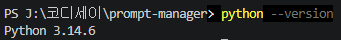

### 2. 프로그램 실행

프로젝트 폴더에서 다음 명령어를 실행합니다.

```bash
python main.py
```

## 메뉴 구성

프로그램을 실행하면 다음 메뉴가 표시됩니다.

```text
=== 나만의 프롬프트 관리 ===

1. 프롬프트 추가
2. 프롬프트 목록
3. 카테고리별 조회
4. 프롬프트 검색
5. 프롬프트 상세 보기
6. 즐겨찾기 관리
7. 즐겨찾기 목록
0. 종료
```

## 카테고리

프롬프트는 다음 카테고리로 관리할 수 있습니다.

| 카테고리   | 설명                          |
| ------ | --------------------------- |
| 텍스트 생성 | 글 작성, 요약, 답변 등 텍스트 생성용 프롬프트 |
| 이미지 생성 | AI 이미지 제작을 위한 프롬프트          |
| 영상 생성  | AI 영상 제작을 위한 프롬프트           |
| 페르소나   | AI의 역할과 전문성을 설정하는 프롬프트      |
| 자동화    | 반복 작업 및 업무 자동화를 위한 프롬프트     |
| 기타     | 위 카테고리에 포함되지 않는 프롬프트        |

## 데이터 구조

프롬프트 데이터는 Python의 **리스트와 딕셔너리**를 사용하여 관리합니다.

각 프롬프트는 다음 정보를 포함합니다.

- 제목
- 내용
- 카테고리
- 즐겨찾기 여부

리스트는 여러 개의 프롬프트를 순서대로 관리하기에 적합하고, 딕셔너리는 각 프롬프트의 제목, 내용, 카테고리, 즐겨찾기 여부를 키와 값으로 명확하게 관리할 수 있어 두 자료구조를 함께 사용했습니다.

리스트의 장점은 여러 프롬프트를 하나의 데이터로 묶어 반복문을 이용해 쉽게 조회하고 검색할 수 있다는 점입니다. 단점은 데이터의 위치를 인덱스로 관리하기 때문에 항목이 많아지면 특정 데이터를 찾는 과정이 필요하다는 점입니다.

딕셔너리의 장점은 각 데이터를 키로 구분하여 필요한 정보를 쉽게 확인하고 수정할 수 있다는 점입니다. 단점은 데이터 구조가 복잡해질 경우 여러 개의 키와 값을 관리해야 한다는 점입니다.

현재 버전에서는 데이터를 별도의 파일이나 데이터베이스에 저장하지 않습니다. 따라서 프로그램을 실행하는 동안 추가하거나 변경한 데이터는 프로그램이 종료되면 초기화됩니다. 이는 이번 프로젝트의 필수 요구사항인 프로그램 실행 중 데이터 관리와 일치합니다.

향후 데이터의 영속성이 필요할 경우 JSON 파일을 활용하여 프롬프트 데이터를 저장하고 프로그램이 시작될 때 저장된 데이터를 불러오는 방식으로 확장할 수 있습니다. JSON은 Python의 리스트와 딕셔너리 구조를 저장하기에 적합하므로 현재의 데이터 구조를 크게 변경하지 않고도 적용할 수 있습니다.

현재 버전에서는 동일한 제목의 프롬프트를 별도로 제한하지 않고 추가할 수 있습니다. 동일한 제목의 프롬프트가 여러 개 존재할 경우 프로그램에서 표시되는 프롬프트 번호를 기준으로 각각의 항목을 구분합니다.

향후 프로그램을 확장할 경우 제목과 카테고리 등을 기준으로 중복 여부를 확인하고, 동일한 제목의 프롬프트가 발견되면 사용자에게 중복 사실을 안내한 후 추가 여부를 선택할 수 있도록 개선할 수 있습니다.

## 기본 제공 프롬프트

프로그램 실행 시 이전 미션에서 작성한 프롬프트가 기본 데이터로 등록되어 있습니다.

* 교육생 문의사항 응대 봇
* Tripmind AI 광고 - 지친 여행자 탈출
* 핵심 쏙쏙 회의록 요약

## 프로젝트 구조

```text
prompt-manager/
├── main.py                 # 프롬프트 관리 프로그램
├── README.md               # 프로젝트 설명 및 사용 방법
├── .gitignore              # Git 관리에서 제외할 파일 설정
└── images/                 # 프로젝트 실행 및 개발 과정 스크린샷
    ├── 01_github.png       # GitHub 저장소 및 프로젝트 파일 구조
    ├── 02_main.png         # 프로그램 실행 및 메인 메뉴 화면
    ├── 03_list.png         # 등록된 프롬프트 전체 목록 조회
    ├── 04_search.png       # 키워드를 이용한 프롬프트 검색
    ├── 05_favorite.png     # 프롬프트 즐겨찾기 추가 및 해제
    ├── 06_favorites.png    # 즐겨찾기 프롬프트 목록 조회
    ├── 07_add_prompt.png   # add_prompt() 함수 구현 화면
    ├── 08_show_menu.png    # show_menu() 함수 구현 화면
    ├── 09_git_log.png      # Git 커밋 10개 이상 및 브랜치 병합 기록
    ├── 10_version.png      # Python 버전 확인 화면
    ├── 11_git_setting.png  # Git 사용자 이름 및 이메일 설정 화면
    ├── 12_vscode.png       # VSCode 프로젝트 및 개발 환경 화면
    ├── 13_category.png     # 카테고리별 프롬프트 조회 화면
    ├── 14_detail.png       # 프롬프트 상세 내용 조회 화면
    └── 15_git_version.png  # Git 버전 확인 화면
```


## 개발 환경

* Python 3.10 이상
* Visual Studio Code
* Git
* GitHub

### 1. Python 개발 환경 확인

Python 버전이 3.10 이상인지 확인했습니다.


### 2. Git 버전 확인

Git이 정상적으로 설치되어 있는지 확인합니다.

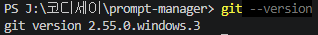

### Git Clone

GitHub 원격 저장소를 로컬 환경으로 복제하여 프로젝트를 확인했습니다.

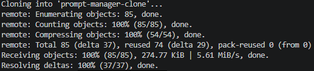

### Git 사용자 설정

Git 사용자 이름과 이메일이 설정되어 있는지 확인했습니다.

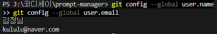

### VSCode 개발 환경

VSCode에서 프로젝트를 생성하고 Python 프로그램을 개발했습니다.

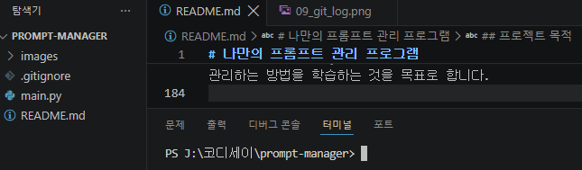

## Git 관리

기능별로 브랜치를 생성하여 작업하고, 기능이 완성되면 커밋한 후 main 브랜치로 병합했습니다.

- 기능 단위로 의미 있는 커밋 작성
- 기능별 브랜치 생성 및 작업
- `checkout`을 이용한 브랜치 이동
- `merge`를 이용한 기능 병합
- GitHub 원격 저장소에 코드 업로드

브랜치는 하나의 기능이나 작업 단위를 기준으로 분리했습니다. 예를 들어 프롬프트 검색 기능은 `feature/search-prompt`, 즐겨찾기 기능은 `feature/favorite-management`와 같이 기능별로 브랜치를 생성하여 작업했습니다.

커밋 메시지는 변경 내용을 쉽게 파악할 수 있도록 기능 단위로 작성했습니다. 예를 들어 `feat: 프롬프트 검색 기능 구현`, `feat: 프롬프트 상세 보기 기능 구현`, `Add Git version screenshot`과 같이 작업 내용을 나타내는 메시지를 사용했습니다.

### Git 주요 명령어 사용

프로젝트 개발 과정에서 다음 Git 명령어를 사용했습니다.

| 명령어 | 사용 목적 |
|---|---|
| `git init` | 로컬 프로젝트 폴더를 Git 저장소로 초기화 |
| `git add` | 변경된 파일을 커밋할 대상으로 추가 |
| `git commit` | 기능 단위로 변경 내용을 저장 |
| `git push` | 로컬 저장소의 변경 내용을 GitHub 원격 저장소에 업로드 |
| `git pull` | 원격 저장소의 변경 내용을 로컬 저장소로 가져옴 |
| `git checkout` | 브랜치를 생성하거나 다른 브랜치로 이동 |
| `git clone` | GitHub 원격 저장소를 새로운 로컬 폴더로 복제 |
| `git merge` | 기능 브랜치의 작업 내용을 main 브랜치에 병합 |

## 프로젝트 실행 및 주요 화면

### 1. GitHub 프로젝트 구조

GitHub 저장소에서 프로젝트 파일과 README를 확인할 수 있습니다.

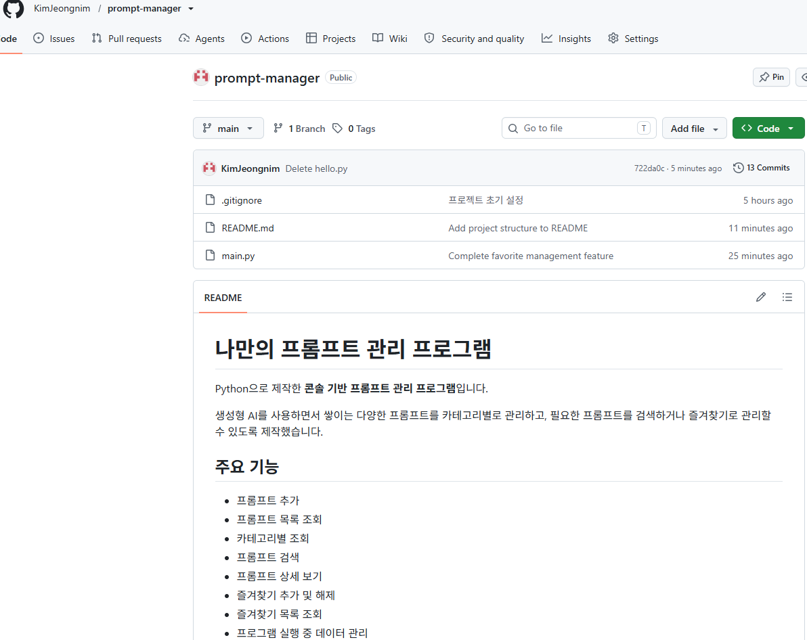

### 2. 프로그램 실행

`python main.py` 명령어를 통해 프로그램을 실행합니다.

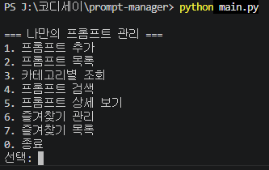

### 3. 프롬프트 목록 조회

등록된 프롬프트의 제목, 카테고리 및 즐겨찾기 상태를 확인할 수 있습니다.

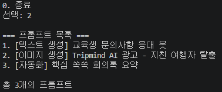

### 4. 프롬프트 검색

검색어를 입력하여 원하는 프롬프트를 검색할 수 있습니다.

제목과 내용에 검색어가 포함되어 있는지 확인하는 부분 문자열 검색 방식을 사용하며, 대소문자를 구분하지 않도록 처리했습니다.


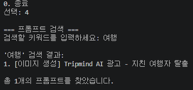

### 5. 즐겨찾기 추가

원하는 프롬프트를 선택하여 즐겨찾기로 추가하거나 해제할 수 있습니다.

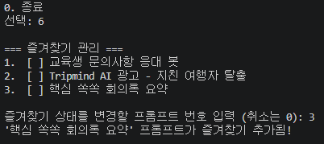

### 6. 즐겨찾기 목록

즐겨찾기로 등록된 프롬프트만 별도로 확인할 수 있습니다.

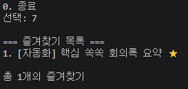

### 7. 카테고리별 조회

카테고리를 선택하여 해당 카테고리에 등록된 프롬프트만 조회할 수 있습니다.

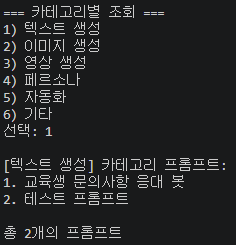

### 8. 프롬프트 상세 보기

프롬프트의 제목, 카테고리, 즐겨찾기 상태 및 전체 내용을 확인할 수 있습니다.

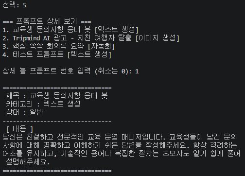

### 9. 프롬프트 추가 기능 구현

`add_prompt()` 함수를 통해 제목, 내용, 카테고리를 입력받고 새로운 프롬프트를 리스트에 추가하도록 구현했습니다.

입력 과정에서는 제목과 내용이 비어 있는 경우 다시 입력하도록 검증하고, 숫자를 입력하는 메뉴에서는 올바른 범위를 벗어난 입력을 안내하여 프로그램이 중단되지 않도록 처리했습니다.

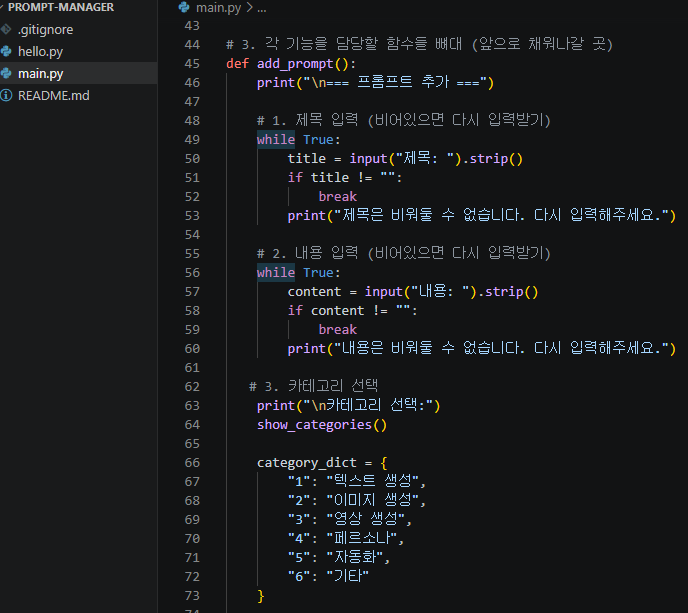

### 10. 메뉴 출력 기능 구현

`show_menu()` 함수를 통해 프로그램의 주요 기능을 메뉴 형태로 출력하도록 구현했습니다.

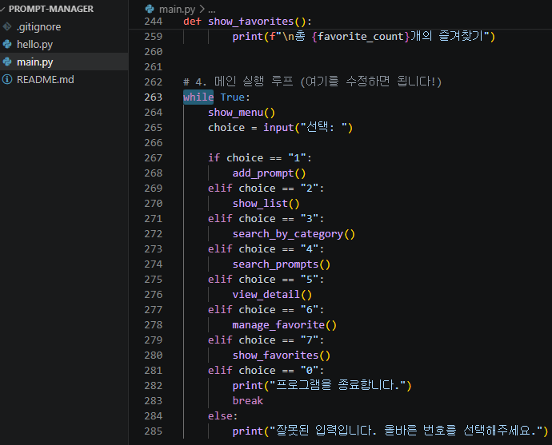

### 11. Git 커밋 및 브랜치 기록

기능별 커밋과 브랜치 생성 및 병합 과정을 Git 로그로 확인할 수 있습니다.

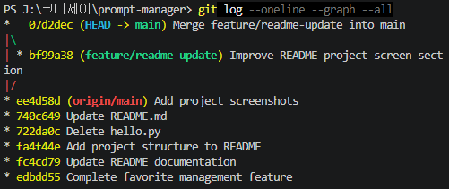

## 프로그램 실행 구조

프로그램은 `while` 반복문을 사용하여 메뉴를 계속 표시하고 사용자의 선택에 따라 해당 기능을 실행하도록 구성했습니다.

각 기능이 실행된 후에는 다시 메인 메뉴로 돌아가 다음 기능을 선택할 수 있습니다. 사용자가 `0. 종료`를 선택하면 반복문을 종료하고 프로그램을 끝냅니다.

잘못된 메뉴 번호를 입력한 경우에는 안내 메시지를 출력한 후 반복문을 계속 실행하여 다시 메뉴를 선택할 수 있도록 처리했습니다.

## 프로젝트 목적

이 프로젝트를 통해 Python의 기본 문법을 활용하여 실제 동작하는 프로그램을 구현하고, Git과 GitHub를 이용하여 코드의 변경 이력을 관리하는 방법을 학습하는 것을 목표로 합니다.
